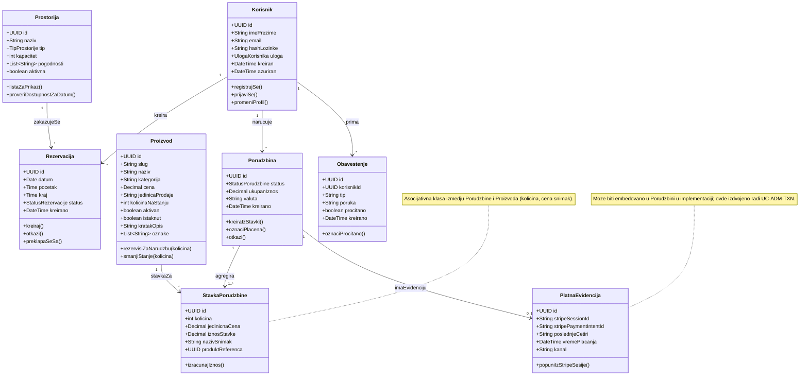
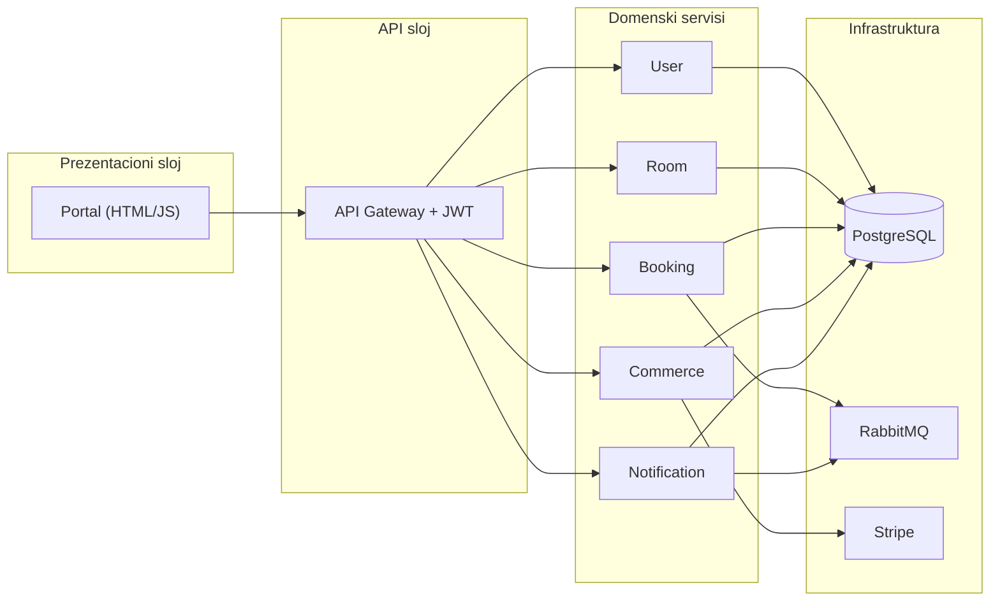
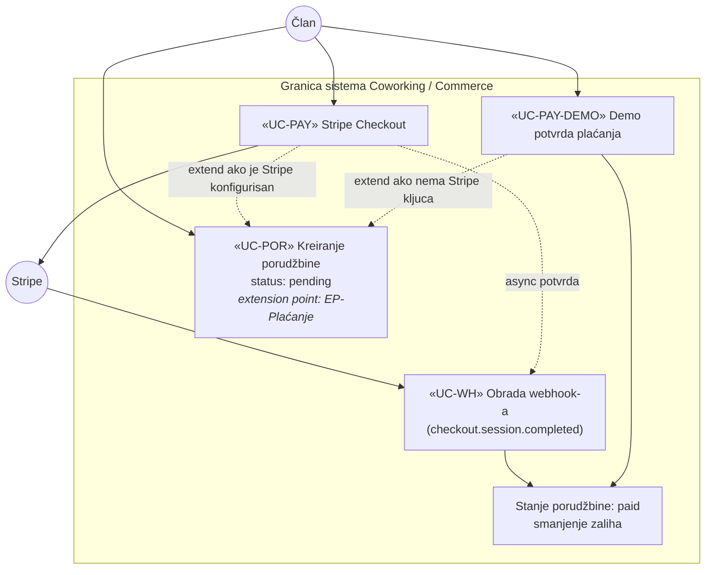
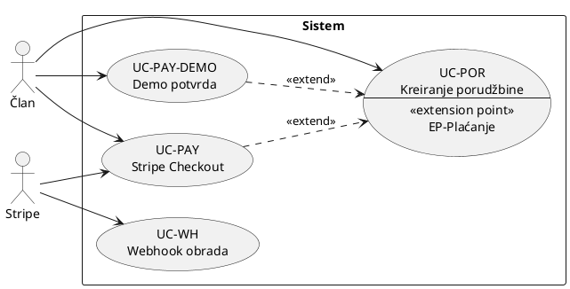

# Zadatak I — UML modeliranje (EONIS 2025/26)

**Naslov projekta po predmetu:** veb prodavnica (prilagođena tema: *coworking portal — rezervacije prostora i prodaja paketa/usluga*).  
**Repozitorijum:** `coworking-booking-system` (mikroservisi + statički portal).

---

## 0. Šta tačno zahteva Zadatak I (citiran zahtev)

Prema **Projektnoj specifikaciji EONIS** za ovaj predispitni zadatak važi sledeće:

1. **Dijagram slučajeva upotrebe** uz identifikaciju **ključnih poslovnih procesa** sistema.  
2. **Dijagram klasa** koji predstavlja **statičku strukturu** sistema.  
3. **Prateći tekst:** odgovarajući **opisi slučajeva upotrebe** i **opisi relacija (veza) između klasa**.

Specifikacija za zajedničku osnovu veb prodavnice navodi da su osnovne tabele / koncepti tipično: **proizvod/artikal/usluga**, **korisnik**, **zaposleni/admin**, **porudžbina**, uz **asocijativne klase** gde logika to zahteva (npr. stavka porudžbine). U ovom projektu su dodati domenski elementi za coworking (**prostorija**, **rezervacija**) i podrška za **plaćanje preko spoljnog procesora** i **webhook** (Zadatak IV predmeta), što je uključeno u slučajeve upotrebe i u klasni model.

**Napomena za Word/PDF:** dijagrami su u **Mermaid** sintaksi; eksport PNG/SVG: [mermaid.live](https://mermaid.live). Za štampu visokog kvaliteta preporučuje se ponovno crtanje u StarUML / Enterprise Architect / Visual Paradigm uz ovaj dokument kao legendu.

---

## 1. Pregled iteracija (više prolaza razvoja modela)

Model je razvijan **iterativno**: svaka iteracija dodaje skuplje poslovne procese i klase, dok prethodni ostaju stabilni. Ovo olakaša odbranu („šta je prvo bilo u obimu, šta je dograđeno“).

| Iteracija | Fokus | Ključni poslovni procesi (grupe UC) | Nova ili jačana klasa u domenu |
|-----------|--------|-------------------------------------|--------------------------------|
| **I1** | Identitet i javni katalog | Registracija, prijava, pregled prostorija i paketa | `Korisnik`, `Prostorija`, `Proizvod` |
| **I2** | Rezervacije | Kreiranje i otkazivanje rezervacije, zauzetost, obaveštenja | `Rezervacija`, `Obaveštenje` |
| **I3** | Porudžbina i plaćanje | Kreiranje porudžbine, Stripe Checkout, demo plaćanje, istorija kupca | `Porudzbina`, `StavkaPorudzbine`, `PlatnaEvidencija` |
| **I4** | Administracija i integracije | CRUD paketa, pregled svih transakcija, obrada webhook-a | Veze admin aktera na iste klase + spoljni `Stripe` |

---

## 2. Dijagram slučajeva upotrebe

### 2.1 Granica sistema i akteri

**Sistem:** „Coworking & commerce backend + portal“ (jedinstvena poslovna granica prema korisniku; tehnička podela na mikroservise nije prikazana na UC dijagramu).

**Akteri:**

| Akter | Tip | Opis |
|-------|-----|------|
| **Gost** | Primarni / ljudski | Nije ulogovan; koristi javne funkcije. |
| **Član** | Primarni / ljudski | Ulogovan korisnik u ulozi kupca/customer (EONIS: **CUSTOMER**). |
| **Administrator** | Primarni / ljudski | Ulogovan korisnik u ulozi **ADMIN** (EONIS: **zaposleni/admin**); koristi administrativne funkcije. |
| **Stripe** | Sekundarni / sistem | Spoljni payment processor; učestvuje u plaćanju i slanju webhook događaja. |

**Generalizacija aktera (UML):** *Član* i *Administrator* su specijalizacije zajedničkog **Registrovanog korisnika** (isti entitet `Korisnik`, različita `Uloga`). Na dijagramu se često crta strelica generalizacije ka zajedničkom akteru; ovde je tekstualno pojasnjeno radi jednostavnije čitljivosti Mermaid-a.

### 2.2 Grafikon — pregled slučajeva i poslovnih oblasti

```mermaid
flowchart TB
  subgraph BP1["BP1 — Identitet i pristup"]
    UC01[[UC-REG Registracija]]
    UC02[[UC-AUTH Prijava]]
    UC03[[UC-LOG Odjava]]
  end

  subgraph BP2["BP2 — Katalog"]
    UC04[[UC-KAT-P Prostorije i dostupnost]]
    UC05[[UC-KAT-PKG Paketi i cenovnik]]
  end

  subgraph BP3["BP3 — Rezervacije"]
    UC06[[UC-BRK Kreiranje rezervacije]]
    UC07[[UC-BRO Otkazivanje rezervacije]]
    UC08[[UC-NOT Slanje obaveštenja o rezervaciji]]
  end

  subgraph BP4["BP4 — Porudžbina i plaćanje (veb prodavnica)"]
    UC09[[UC-POR Kreiranje porudžbine]]
    UC10[[UC-PAY Hostovano plaćanje Stripe]]
    UC11[[UC-PAY-DEMO Demo potvrda plaćanja]]
    UC12[[UC-MIP Moje porudžbine]]
    UC13[[UC-WH Webhook potvrda plaćanja]]
  end

  subgraph BP5["BP5 — Administracija"]
    UC14[[UC-ADM-KOR Pregled / status korisnika u portalu]]
    UC15[[UC-ADM-BRK Pregled rezervacija]]
    UC16[[UC-ADM-PR CRUD proizvoda]]
    UC17[[UC-ADM-TXN Pregled transakcija]]
  end

  Gost((Gost))
  Clan((Član))
  Admin((Administrator))
  Stripe((Stripe))

  Gost --> UC01
  Gost --> UC02
  Gost --> UC04
  Gost --> UC05

  Clan --> UC02
  Clan --> UC03
  Clan --> UC04
  Clan --> UC05
  Clan --> UC06
  Clan --> UC07
  Clan --> UC09
  Clan --> UC10
  Clan --> UC11
  Clan --> UC12

  Admin --> UC02
  Admin --> UC03
  Admin --> UC14
  Admin --> UC15
  Admin --> UC16
  Admin --> UC17

  UC06 -. include .-> UC08
  UC07 -. include .-> UC08
  UC09 -. include .-> UC05
  UC10 -.-> Stripe
  UC13 <-- Stripe

  UC09 -. extend .-> UC10
  UC09 -. extend .-> UC11
```

**Čitanje veza na dijagramu:**

- **«include»** (isprekidano): osnovni tok uvek uključi pomoćni proces (npr. rezervacija uvek može pokrenuti slanje obaveštenja).  
- **«extend»** (isprekidano): opcioni tok — porudžbina se može završiti ili **Stripe Checkout** (UC-PAY) ili **demo plaćanjem** (UC-PAY-DEMO), u zavisnosti od konfiguracije.  
- **Stripe**: direktna interakcija za plaćanje i za webhook.

### 2.3 Klasični use case dijagram (Mermaid)

```mermaid
usecaseDiagram
  actor Gost
  actor Clan as "Član (CUSTOMER)"
  actor Administrator as "Administrator (ADMIN)"
  actor Stripe as "Stripe"

  Gost --> (Registracija)
  Gost --> (Prijava)
  Gost --> (Pregled prostorija)
  Gost --> (Pregled paketa)

  Clan --> (Prijava)
  Clan --> (Odjava)
  Clan --> (Pregled prostorija)
  Clan --> (Pregled paketa)
  Clan --> (Rezervacija - kreiranje)
  Clan --> (Rezervacija - otkazivanje)
  Clan --> (Kreiranje porudžbine)
  Clan --> (Stripe placanje)
  Clan --> (Demo placanje)
  Clan --> (Moje porudžbine)

  Administrator --> (Prijava)
  Administrator --> (Odjava)
  Administrator --> (Admin - korisnici)
  Administrator --> (Admin - rezervacije)
  Administrator --> (Admin - CRUD proizvod)
  Administrator --> (Admin - transakcije)

  Stripe --> (Webhook obrada)
```

*(Za štampu: dodati „stick man“ za zajedničkog aktera **Registrovani korisnik** i generalizacija ka Član/Administrator.)*

---

## 3. Katalog slučajeva upotrebe (master lista)

| ID | Naziv | Akteri | Poslovna oblast | Iteracija |
|----|--------|--------|-------------------|-----------|
| UC-REG | Registracija naloga | Gost | BP1 | I1 |
| UC-AUTH | Prijava | Gost, Član, Administrator | BP1 | I1 |
| UC-LOG | Odjava | Član, Administrator | BP1 | I1 |
| UC-KAT-P | Pregled prostorija i zauzetosti | Gost, Član | BP2 | I1 |
| UC-KAT-PKG | Pregled paketa (paginacija, sort, pretraga) | Gost, Član | BP2 | I1 |
| UC-BRK | Kreiranje rezervacije | Član | BP3 | I2 |
| UC-BRO | Otkazivanje rezervacije | Član | BP3 | I2 |
| UC-NOT | Slanje obaveštenja vezano za rezervaciju | Sistem → Član | BP3 | I2 |
| UC-POR | Kreiranje porudžbine (stavke, stanje) | Član | BP4 | I3 |
| UC-PAY | Hostovano plaćanje (Stripe Checkout) | Član, Stripe | BP4 | I3 |
| UC-PAY-DEMO | Demo potvrda plaćanja bez live Stripe | Član | BP4 | I3 |
| UC-MIP | Pregled sopstvenih porudžbina | Član | BP4 | I3 |
| UC-WH | Obrada Stripe webhook-a (potvrda plaćanja) | Stripe, Sistem | BP4 | I4 |
| UC-ADM-KOR | Administracija korisnika u portalu | Administrator | BP5 | I4 |
| UC-ADM-BRK | Pregled i operacije nad rezervacijama | Administrator | BP5 | I4 |
| UC-ADM-PR | CRUD proizvoda/paketa | Administrator | BP5 | I4 |
| UC-ADM-TXN | Pregled svih porudžbina / transakcija | Administrator | BP5 | I4 |

---

## 4. Detaljni opisi slučajeva upotrebe

Za svaki slučaj koristi se **jedinstven šablon** (preporuka IEEE/IEC stila, skraćeno): preduslov, postuslov, osnovni tok, alternativni tokovi, poslovna pravila.

---

### 4.1 Iteracija I1 — Identitet i katalog

#### UC-REG — Registracija naloga

| Polje | Sadržaj |
|--------|---------|
| **Cilj** | Kreiranje novog naloga člana sistema. |
| **Akteri** | Gost (inicijator), Sistem. |
| **Preduslov** | Gost nije ulogovan; email nije zauzet. |
| **Postuslov uspeha** | Novi `Korisnik` postoji sa ulogom član (`member`); korisnik može da se prijavi. |
| **Postuslov neuspeha** | Nalog nije kreiran; korisnik dobija poruku o razlogu. |
| **Osnovni tok** | 1. Gost unosi ime, email, lozinku. 2. Sistem validira format i jačinu lozinke. 3. Sistem proverava jedinstvenost emaila. 4. Sistem čuva korisnika sa heširanom lozinkom i podrazumevanom ulogom. 5. Sistem potvrđuje uspeh. |
| **Alternativni tok A1** | Email već postoji → korak 4 se preskače, prijavljuje se konflikt (409). |
| **Alternativni tok A2** | Nevalidan unos → korak 2 prekida tok sa validacionim greškama (400). |
| **Poslovna pravila** | Lozinka minimalne dužine; email jedinstven; uloga novog korisnika je kupac. |

#### UC-AUTH — Prijava

| Polje | Sadržaj |
|--------|---------|
| **Cilj** | Autentifikacija i izdavanje sesijskog dokaza (JWT). |
| **Akteri** | Gost / Član / Administrator, Sistem. |
| **Preduslov** | Nalog postoji. |
| **Postuslov uspeha** | Klijent dobija `access_token` i podatke o korisniku (uključujući `role`). |
| **Osnovni tok** | 1. Unos emaila i lozinke. 2. Provera kredencijala. 3. Generisanje JWT sa `sub`, `email`, `role`. |
| **Alternativni tok** | Pogrešna kombinacija → 401. |
| **Poslovna pravila** | Token se koristi na API Gateway-u; identitet se prosleđuje mikroservisima preko zaglavlja. |

#### UC-LOG — Odjava

| Polje | Sadržaj |
|--------|---------|
| **Cilj** | Prekid sesije na klijentskoj strani. |
| **Akteri** | Član, Administrator. |
| **Postuslov** | Token uklonjen iz trajnog skladišta pregledača; korisnik više ne šalje zahteve sa JWT. |

#### UC-KAT-P — Pregled prostorija i zauzetosti

| Polje | Sadržaj |
|--------|---------|
| **Cilj** | Prikaz ponude prostorija i zauzetosti za termin planiranja rezervacije. |
| **Akteri** | Gost, Član. |
| **Osnovni tok** | 1. Zahtev liste prostorija (opciono paginacija/pretraga). 2. Za javni ili članški kalendar: zahtev rezervacija za `roomId` i `date`. 3. Prikaz slobodnih/zauzetih intervala. |
| **Poslovna pravila** | Zauzetost se računa nad aktivnim rezervacijama koje se preklapaju vremenski. |

#### UC-KAT-PKG — Pregled paketa

| Polje | Sadržaj |
|--------|---------|
| **Cilj** | Prikaz kataloga proizvoda/usluga uz paginaciju, sortiranje i pretragu (EONIS Zadatak IV). |
| **Akteri** | Gost, Član. |
| **Osnovni tok** | GET liste proizvoda sa parametrima `page`, `limit`, `sort`, `order`, `search`. |

---

### 4.2 Iteracija I2 — Rezervacije

#### UC-BRK — Kreiranje rezervacije

| Polje | Sadržaj |
|--------|---------|
| **Cilj** | Zakazivanje prostora u izabranom intervalu. |
| **Akteri** | Član, Sistem. |
| **Preduslov** | Član je ulogovan; prostorija je aktivna. |
| **Postuslov uspeha** | Nova `Rezervacija` sa statusom aktivna; eventualno obaveštenje poslato. |
| **Osnovni tok** | 1. Izbor prostorije, datuma, početka i kraja. 2. Serverska validacija formata (datum YYYY-MM-DD, vreme HH:MM, korak 30 min). 3. Provera minimalnog trajanja (≥ 30 min). 4. Provera preklapanja za prostoriju. 5. Provera preklapanja za istog korisnika. 6. Provera dnevnog limita (npr. max 3 aktivne po danu). 7. Persistencija. 8. Asinhrono slanje događaja ka servisu obaveštenja. |
| **Alternativni tokovi** | Bilo koja poslovna pravila iz koraka 4–6 padaju → odbijanje sa jasnom porukom (409/400). |
| **«include»** | Može uključiti UC-NOT (slanje obaveštenja). |

#### UC-BRO — Otkazivanje rezervacije

| Polje | Sadržaj |
|--------|---------|
| **Cilj** | Soft-otkazivanje sopstvene rezervacije. |
| **Akteri** | Član. |
| **Preduslov** | Rezervacija pripada članu i nije već otkazana. |
| **Postuslov** | Status `cancelled`; istorija očuvana. |
| **«include»** | Obaveštenje (UC-NOT) opciono. |

#### UC-NOT — Slanje obaveštenja o rezervaciji

| Polje | Sadržaj |
|--------|---------|
| **Cilj** | Informisanje korisnika o događaju (kreiranje/otkaz). |
| **Akteri** | Sistem (Booking → Notification preko message brokera). |
| **Postuslov** | Zapis `Obaveštenje` ili ekvivalent dostupan korisniku. |

---

### 4.3 Iteracija I3 — Porudžbina i plaćanje

#### UC-POR — Kreiranje porudžbine

| Polje | Sadržaj |
|--------|---------|
| **Cilj** | Formiranje porudžbine sa jednom ili više stavki uz poštovanje stanja zaliha (EONIS univerzalni primer). |
| **Akteri** | Član. |
| **Preduslov** | Član ulogovan; proizvodi izabrani iz kataloga. |
| **Postuslov uspeha** | `Porudzbina` u statusu `pending` sa `StavkaPorudzbine` redovima; iniciran sledeći korak plaćanja. |
| **Osnovni tok** | 1. Slanje stavki `{ productId, quantity }`. 2. Validacija postojanja i aktivnosti proizvoda. 3. Provera `quantity ≤ stanje`. 4. Izračunavanje ukupnog iznosa. 5. Kreiranje porudžbine i stavki u jednoj transakciji per servis. |
| **Alternativni tok** | Nedovoljno stanja → odbijanje sa porukom. |
| **«include»** | UC-KAT-PKG (čitanje aktuelnih cena i naziva — konceptualno uključeno u tok). |
| **«extend»** | UC-PAY ili UC-PAY-DEMO zavisi od konfiguracije Stripe ključa. |

#### UC-PAY — Stripe Checkout

| Polje | Sadržaj |
|--------|---------|
| **Cilj** | Redirect na Stripe hostovani checkout u test modu. |
| **Akteri** | Član, Stripe. |
| **Preduslov** | Postoji `pending` porudžbina; `STRIPE_SECRET_KEY` konfigurisan. |
| **Osnovni tok** | 1. Kreiranje Checkout Session sa line items u EUR. 2. Čuvanje `stripeSessionId` na porudžbini. 3. Vraćanje URL za redirect. 4. Korisnik plaća na Stripe. 5. Povratak na portal (`success_url`). |
| **Postuslov** | Finalni status plaćanja dolazi asinhrono preko UC-WH. |

#### UC-PAY-DEMO — Demo potvrda plaćanja

| Polje | Sadržaj |
|--------|---------|
| **Cilj** | Demonstracija toka plaćanja bez live Stripe naloga. |
| **Akteri** | Član. |
| **Preduslov** | Pending porudžbina; simulacija test kartice na portalu. |
| **Postuslov** | Status `paid`; smanjenje zaliha; evidencija platnog aktera popunjena demonstrativnim referencama. |

#### UC-MIP — Moje porudžbine

| Polje | Sadržaj |
|--------|---------|
| **Cilj** | Lista porudžbina ulogovanog korisnika sa stavkama. |
| **Akteri** | Član. |

#### UC-WH — Webhook obrada

| Polje | Sadržaj |
|--------|---------|
| **Cilj** | Pouzdano ažuriranje sistema po događaju `checkout.session.completed`. |
| **Akteri** | Stripe (inicijator HTTP poziva), Sistem. |
| **Preduslov** | Validan potpis i `STRIPE_WEBHOOK_SECRET`. |
| **Osnovni tok** | 1. Prijem raw tela i verifikacija potpisa. 2. Parsiranje `metadata.orderId`. 3. Idempotentna obrada (ne duplo plaćanje). 4. Postavljanje statusa porudžbine na `paid`, čuvanje PI id i last4 ako dostupno. 5. Smanjenje zaliha po stavkama. |
| **Poslovna pravila** | Odgovaraju EONIS zahtevu da administrator vidi transakciju nakon webhook-a. |

---

### 4.4 Iteracija I4 — Administracija

#### UC-ADM-KOR — Admin: korisnici

Pregled i jednostavno upravljanje statusom korisnika u skladu sa portalom (vizuelni admin panel).

#### UC-ADM-BRK — Admin: rezervacije

Uvidi u rezervacije svih korisnika radi operativnog upravljanja prostorom.

#### UC-ADM-PR — Admin: CRUD proizvoda

Kreiranje, izmena, logičko brisanje (deaktivacija) paketa — **CRUD** kao u Zadatku III.

#### UC-ADM-TXN — Admin: transakcije

Prikaz porudžbina sa podacima relevantnim za Stripe (session, payment intent, iznos, kupac kao ID/povezivanje sa korisnikom u UI).

---

## 5. Dijagram klasa — konceptualni model

### 5.1 Osnovni dijagram (statička struktura domena)

Prikazuje klasama predviđene entitete iz specifikacije (**korisnik**, **admin** kao vrednost uloge, **proizvod**, **porudžbina**) i dodatne coworking klase (**prostorija**, **rezervacija**), uz **asocijativnu klasu** `StavkaPorudzbine` i klasu za **platnu evidenciju** radi jasnog prikaza podataka koje vidi administrator posle plaćanja.



### 5.2 Tipovi i enumeracije

| Tip | Vrednosti / značenje |
|-----|----------------------|
| `UlogaKorisnika` | `member` (CUSTOMER), `admin` (ADMIN / zaposleni sa pravima) |
| `TipProstorije` | npr. `meeting_room`, `phone_booth`, `event_space` |
| `StatusRezervacije` | `active`, `cancelled` |
| `StatusPorudzbine` | `pending`, `paid`, `cancelled` |
| `Novac` | decimalni tip valute (EUR u Stripe toku) |

### 5.3 Implementacioni pogled (paketi — opcioni dijagram)

Ovaj dijagram **ne zamenjuje** konceptualni; služi za objašnjenje mikroservisa u dokumentaciji Zadatka V.



---

## 6. Detaljni opis veza između klasa (relacije)

Za svaku vezu navode se **multiplicitet**, **semantika**, **navigacija** (ko „zna“ za koga u tipičnom upitu) i **ograničenja**.

### 6.1 Tabele relacija

#### Korisnik ↔ Rezervacija

| Aspekt | Opis |
|--------|------|
| Multiplicitet | `1` : `*` |
| Ime veze | Korisnik **kreira** rezervacije |
| Navigacija | Od korisnika ka rezervacijama (lista „moje rezervacije“); od rezervacije ka `korisnikId`. |
| Ograničenje | `(status = cancelled)` i dalje čuva istoriju; aktivne rezervacije podležu poslovnim pravilima preklapanja. |

#### Prostorija ↔ Rezervacija

| Aspekt | Opis |
|--------|------|
| Multiplicitet | `1` : `*` |
| Ime veze | Prostorija **je predmet** zakazivanja |
| Ograničenje | Ne može dve aktivne rezervacije iste prostorije u preklapajućem intervalu na isti datum. |

#### Korisnik ↔ Porudzbina

| Aspekt | Opis |
|--------|------|
| Multiplicitet | `1` : `*` |
| Ime veze | Kupac **naručuje** porudžbine |
| Napomena | Administrator ne mora imati poseban tip „Zaposleni“ u modelu ako je admin ista tabela sa drugom ulogom (realizacija JWT). |

#### Porudzbina ↔ StavkaPorudzbine

| Aspekt | Opis |
|--------|------|
| Multiplicitet | `1` : `1..*` |
| Ime veze | **Kompozicija/agregacija** stavki u porudžbini |
| Značaj | Asocijativna struktura koja nosi **količinu** i **iznos** kao atribute veze između porudžbine i proizvoda. |

#### Proizvod ↔ StavkaPorudzbine

| Aspekt | Opis |
|--------|------|
| Multiplicitet | `1` : `*` |
| Ime veze | Proizvod se pojavljuje u mnogim stavkama |
| Ograničenje | `kolicinaNaStanju` mora biti ≥ tražena količina u trenutku kreiranja porudžbine; posle plaćanja stanje opada. |

#### Porudzbina ↔ PlatnaEvidencija

| Aspekt | Opis |
|--------|------|
| Multiplicitet | `1` : `0..1` |
| Ime veze | Jedna porudžbina ima najviše jednu **potpunu** Stripe/dokumentacionu evidenciju po uspešnom plaćanju (demo mod može mapirati ista polja). |

#### Korisnik ↔ Obaveštenje

| Aspekt | Opis |
|--------|------|
| Multiplicitet | `1` : `*` |
| Ime veze | Korisnik prima događaje iz sistema rezervacija |

### 6.2 Invarijante (statička pravila)

1. **Σ iznos stavki** mora biti konzistentan sa `Porudzbina.ukupanIznos` u trenutku potvrde porudžbine.  
2. **Neaktivan proizvod** ne sme ući u novu porudžbinu.  
3. **Rezervacija** mora imati `kraj > početak` i granula od 30 minuta gde je to poslovno definisano.  
4. **Platna evidencija** se puni tek kada je plaćanje potvrđeno (Webhook ili demo endpoint).

---

## 7. Tragljivost: slučaj upotrebe → klase / artefakti

| UC | Direktno dirnuti koncepti klasa |
|----|--------------------------------|
| UC-REG, UC-AUTH | `Korisnik` |
| UC-KAT-P | `Prostorija`, `Rezervacija` (za prikaz zauzetosti) |
| UC-KAT-PKG | `Proizvod` |
| UC-BRK, UC-BRO | `Korisnik`, `Prostorija`, `Rezervacija` |
| UC-NOT | `Obaveštenje`, `Korisnik` |
| UC-POR | `Korisnik`, `Porudzbina`, `StavkaPorudzbine`, `Proizvod` |
| UC-PAY, UC-WH, UC-PAY-DEMO | `Porudzbina`, `StavkaPorudzbine`, `Proizvod`, `PlatnaEvidencija` |
| UC-ADM-* | Iste klase + autorizacija uloga na gateway-u |

---

## 8. Dodatak — poseban prikaz plaćanja («extend»: Stripe vs demo)

Ovaj dodatak služi za **odbranu i štampu**: izdvaja samo granu **porudžbina → plaćanje → potvrda**, jer je to najčešće mesto gde asistenti pitaju za **«extend»**, **tačku proširenja** i ulogu **Stripe** + **webhook-a**.

### 8.1 Koncept (UML 2.x)

- **`UC-POR` — Kreiranje porudžbine** je **osnovni** (bazni) slučaj upotrebe: posle njega porudžbina ostaje u stanju *pending* dok se ne potvrdi plaćanje.  
- **`UC-PAY`** i **`UC-PAY-DEMO`** su **varijante nastavka** — u školskoj interpretaciji modeluju se kao **`«extend»`** u odnosu na `UC-POR`, jer se **aktiviraju uslovno** (konfiguracija sistema), a ne u svakom izvršavanju `UC-POR`.  
- **`UC-WH`** **ne «extend»-uje** direktno `UC-POR`: to je **reaktivan** scenario koji pokreće **sekundarni akter Stripe** (serverski događaj). Sa stanovišta dokumentacije ga crtamo **pored** toka plaćanja i povežemo objašnjenjem u tekstu.

**Tačka proširenja (extension point)** — logički naziv u dokumentaciji:

| Tačka proširenja | Bazni UC | Značenje |
|------------------|----------|----------|
| **EP-Plaćanje** | UC-POR | Nakon kreiranja *pending* porudžbine sistem bira jedan od nastavaka: hostovano plaćanje ili demo potvrda. |

### 8.2 Slika — samo gran placanja (Mermaid)



**Kako čitati strelice:**

- Isprekidana strelica ka **`UC-POR`** označava stereotip **`«extend»`**: proširenje baznog slučaja u tački **EP-Plaćanje**.  
- Puna strelica **`Član → PAY/DEMO`** označava da član **inicira** izabrani nastavak posle kreiranja porudžbine.  
- **`UC-WH`** završava potvrdu kada je u pogonu Stripe; **`UC-PAY-DEMO`** direktno prelazi u **`paid`** bez webhook-a (projektni demo režim).

### 8.3 Tekstualna šema za StarUML / Visual Paradigm (korak po korak)

*(Ne zalepi kao kod — koristi kao checklist dok crtaš.)*

1. **Granica sistema** (rectangle): naziv npr. *Coworking portal i backend*.  
2. Unutra nacrtaj **oval** *«UC-POR» Kreiranje porudžbine*.  
3. Ispod ili sa strane dva **oval**a: *«UC-PAY» Stripe Checkout* i *«UC-PAY-DEMO» Demo potvrda plaćanja*.  
4. Od **oba** ovala povuci **isprekidane strelice** stereotipa **`«extend»`** ka *«UC-POR»* (smer: od **proširujućeg** slučaja ka **baznom**, po UML konvenciji koju koristi većina alata — ako alat obrće smer, u legendi napiši koju konvenciju pratiš).  
5. U **napomeni** (Note) uz *«UC-POR»* upiši: *Extension point: EP-Plaćanje — uslov izbora PAY vs DEMO*.  
6. Akter **Član** — pun linija asocijacije ka *«UC-POR»*, *«UC-PAY»*, *«UC-PAY-DEMO»*.  
7. Akter **Stripe** — van granice; asocijacija ka *«UC-PAY»* i ka *«UC-WH»*.  
8. Oval *«UC-WH» Webhook obrada* — asocijacija od **Stripe** ka ovom slučaju; opciono od *«UC-PAY»* **zavisnosti** (`«dependency»`) ka *«UC-WH»* sa napomenom „async potvrda“.  
9. U legendi dokumenta obavezno definiši simbole **`«extend»`**, **`«include»`** (ako ih oba koristiš) i pravilo koje koristiš za **smer strelice extend**.

### 8.4 PlantUML fragment (opciono — za generisanje PNG)



*(Online renderer: [plantuml.com/plantuml](https://www.plantuml.com/plantuml) — kopiraj blok između `@startuml` / `@enduml`.)*

---

## 9. Zaključak za Zadatak I

Ovaj dokument ispunjava formalne zahteve predmeta:

1. **Dijagram slučajeva upotrebe** — sa grupisanjem po **poslovnim procesima**, akterima usklađenim sa **CUSTOMER** i **ADMIN**, sekundarnim **Stripe** akterom, te vezama **«include» / «extend»** tamo gde to ima smisla.  
2. **Opisi slučajeva upotrebe** — u strukturi preduslov / tok / alternativa / poslovna pravila, pokriveni kroz **više iteracija**.  
3. **Dijagram klasa** — prikazuje **statičku strukturu** sa entitetima koji odgovaraju EONIS osnovi veb prodavnice i proširenju coworking domenom.  
4. **Opis relacija** — posebno naglašava **asocijativnu prirodu** `StavkaPorudzbine` i pravila zaliha/plaćanja usklađena sa Zadatkom II (koji posebno razrađuješ u bazi).

Za finalnu predaju u Word dokument preporuka je: **naslovna strana**, **sadržaj**, ova poglavlja numerisana, **slike dijagrama** kao figure (Slika 1, 2, …) i kratka **legenda simbola** UML (akteri, granica sistema, multiplicitet).

---

*Verzija dokumenta: 2.1 (dodatak plaćanje / «extend»). Izvor zahteva: Projektna specifikacija EONIS 2025/26, Zadatak I.*
